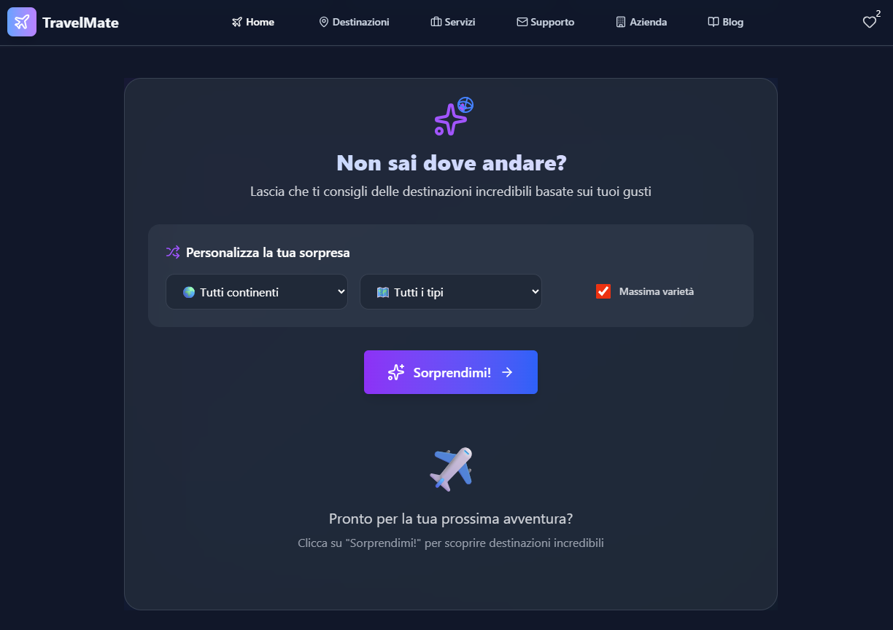
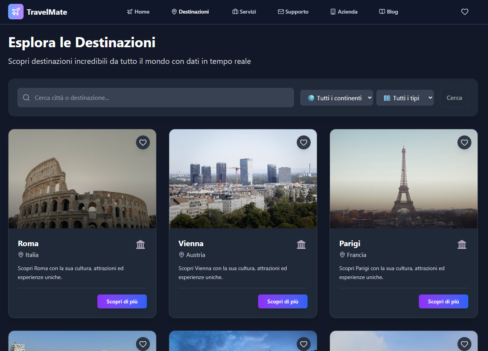
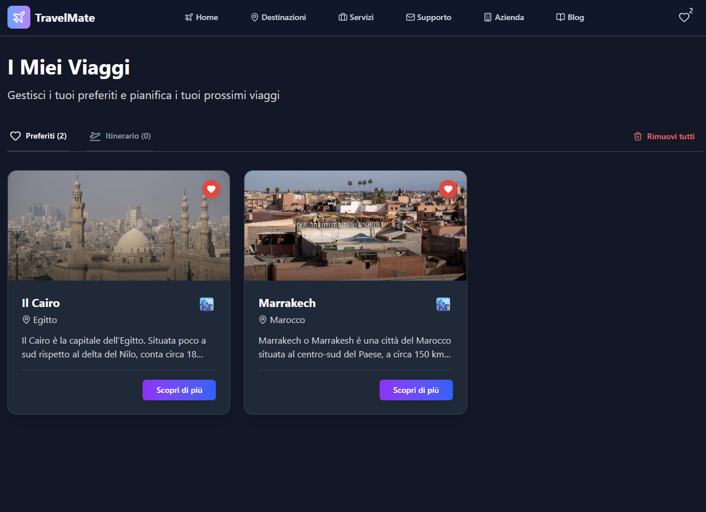
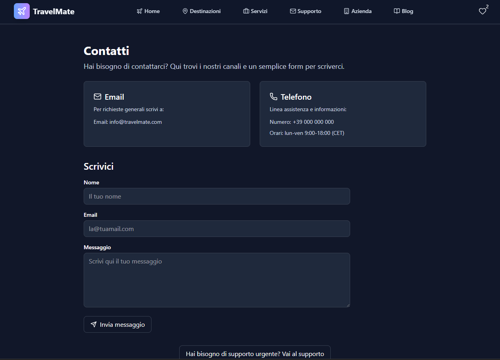
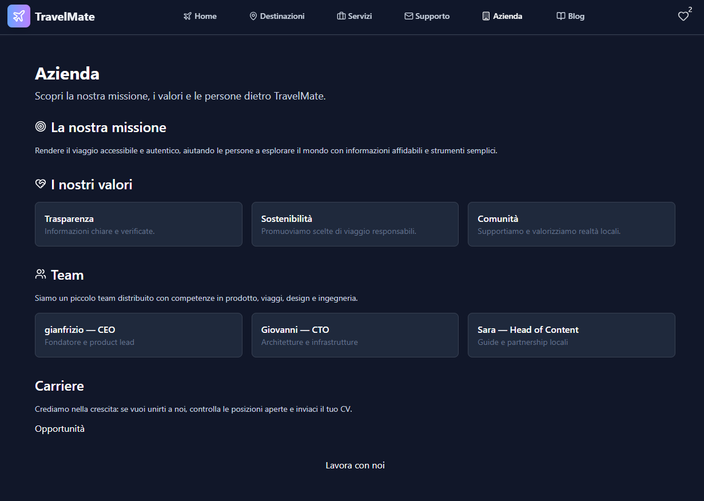
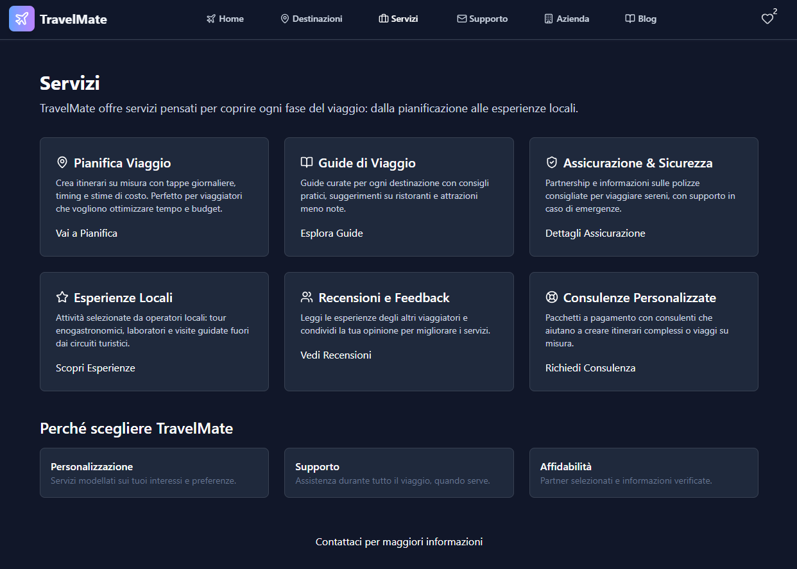

# 🌍 TravelMate - La tua app di viaggio

TravelMate è un'applicazione web moderna per viaggiatori che permette di esplorare destinazioni incredibili, salvare itinerari personalizzati e scoprire consigli di viaggio.

## ✨ Funzionalità Principali

### 🏠 Homepage Accattivante
- **Hero section** con immagini mozzafiato e call-to-action
- **Search bar** per trovare destinazioni rapidamente
- **Sezione destinazioni in evidenza** con le mete più popolari
- **Statistiche** sui viaggiatori e le destinazioni

### 🔍 Ricerca Destinazioni Avanzata
- **Grid responsive** con card delle destinazioni
# 🌍 TravelMate

TravelMate è un'app Next.js (App Router) per esplorare destinazioni, salvare itinerari e leggere consigli di viaggio.

Questo README è pensato per sviluppatori e manutentori: trova qui setup rapido, comandi utili, note su performance e debug rapido.

---

## Requisiti
- Node.js 18+ (consigliato LTS)
- npm (o yarn/pnpm)

## Setup rapido (development)

1. Clona il repository

```bash
git clone <repository-url>
cd TravelMate
```

2. Installa dipendenze

```bash
npm install
```

3. Crea il file `.env.local` in radice (vedi sezione Variabili d'ambiente)

4. Avvia in development

```bash
npm run dev
# Visita http://localhost:3000
```

## Comandi principali
- `npm run dev` — avvia Next.js in sviluppo
- `npm run build` — crea la build di produzione
- `npm start` — avvia il server di produzione (dopo `build`)
- `npm run lint` — esegue ESLint (se abilitato)

## Variabili d'ambiente

Copiale in `.env.local` (non committare):

```env
GEOAPIFY_API_KEY=your_geoapify_api_key
OPENWEATHER_API_KEY=your_openweather_api_key
UNSPLASH_ACCESS_KEY=yor_unsplash_access_key
```

## API esterne utilizzate

Il progetto integra diverse API esterne per geocoding, meteo, immagini e dati di riferimento. Di seguito l'elenco delle API principali usate nel codice, inclusi i servizi di fallback che il codice richiede o prova a consultare:

- `Geoapify` — geocoding forward/reverse per disambiguare nomi di città e ottenere coordinate. Env: `GEOAPIFY_API_KEY`.
- `OpenWeather` — dati meteo correnti (proxy tramite `/api/weather`). Env: `OPENWEATHER_API_KEY`.
- `Wikipedia REST / Media List` — usata per summary, estratti lunghi e media-list della pagina (preferisce la versione italiana quando disponibile). Nessuna chiave richiesta.
- `Wikidata` — consultata per determinare se una voce Wikipedia rappresenta un luogo (P31/instance of). Nessuna chiave richiesta.
- `Unsplash` — prima scelta per foto di città quando `UNSPLASH_ACCESS_KEY` è fornita (env: `UNSPLASH_ACCESS_KEY`).
- `Pexels` — fallback per foto se Wikipedia/Unsplash non forniscono immagini utilizzabili (env: `PEXELS_API_KEY`).
- `Picsum / source.unsplash` — sorgenti statiche/fallback (no API key) usate come ultima risorsa per placeholder immagini.

Note sull'ordine di fallback per le immagini (come implementato in `src/app/api/city-images/route.ts`):

1. Wikipedia summary thumbnail / page media-list (preferito, verifica qualità e filtri su bandiere/loghi)
2. Unsplash (se `UNSPLASH_ACCESS_KEY` è configurata) con query basate su landmark estratti
3. Pexels (se `PEXELS_API_KEY` è configurata)
4. Source statico / Picsum / source.unsplash come fallback

## Struttura principale del progetto

Cartelle Principali e cosa ci trovi dentro (quick reference):

- `src/app` — pagine, layout e route (Next.js App Router). Qui trovi le pagine principali sotto cartelle come `destinations/`, `blog/`, `api/` (route handlers server side) e `layout.tsx` / `page.tsx` globali.
	- Esempi: `src/app/layout.tsx`, `src/app/page.tsx`, `src/app/destinations/[id]/page.tsx`.
- `src/components` — componenti UI riutilizzabili e piccoli widget (Navbar, Footer, Toast, UI primitives). Metti componenti presentazionali e container qui.
	- Esempi: `src/components/Navbar.tsx`, `src/components/Toast.tsx`, `src/components/ui/Button.tsx`.
- `src/context` — provider e context globali (stato dell'app, theme, wishlist). Cerca qui gli helper che persistono su `localStorage`.
	- Esempio: `src/context/AppContext.tsx`.
- `src/hooks` — custom hooks riutilizzabili (fetching, theme, weather). Preferisci qui la logica che incapsula side-effects.
	- Esempi: `src/hooks/useWeather.ts`, `src/hooks/useDestinations.ts`, `src/hooks/useTheme.ts`.
- `src/lib` — utility generiche e helper condivisi (logger, formattazione, utilità per le API).
	- Esempi: `src/lib/logger.ts`, `src/lib/utils.ts`.
- `src/data` — dati statici / mock per development e demo (destinazioni, articoli di blog, mappe di continente).
	- Esempi: `src/data/destinations.ts`, `src/data/blog.ts`, `src/data/countryToContinent.json`.
- `src/types` — definizioni TypeScript condivise per modelli e shape dei dati.
	- Esempio: `src/types/index.ts`.
- `public` — asset statici serviti direttamente (icone, manifest, screenshot, immagini). Usato anche per immagini che vuoi servire direttamente senza passare da next/image.
	- Esempi: `public/screenshots/*`, `public/manifest.json`, `public/robots.txt`.
- `src/app/api` — route API server-side (Next.js route handlers). Qui sono implementati gli endpoint usati dall'app (es. `city-images`, `weather`, `destinations`).
	- Esempi: `src/app/api/city-images/route.ts`, `src/app/api/weather/route.ts`.

Suggerimento: se cerchi dove modificare una funzionalità specifica (es. come vengono scelte le immagini per una città), cerca `city-images/route.ts` sotto `src/app/api` o utilizza `grep` per trovare il nome della funzione/variabile.

## Performance & Lighthouse (note pratiche)

Queste ottimizzazioni sono implementate o raccomandate nel progetto:

- Usa `next/image` per le immagini critiche (hero/LCP) e configura `remotePatterns` in `next.config.ts`.
- Preconnect e preload per host di immagini e Google Fonts sono inseriti in `src/app/layout.tsx`.
- Lazy-load dei componenti non critici con `next/dynamic` (es. `LiveDestinations`, `SurpriseMe`).
- Evita script inline non necessari e concentrare la logica client solo dove serve per ridurre TBT.

Suggerimenti per misurare e migliorare rapidamente:

- Esegui Lighthouse in modalità mobile (Device: Moto G4, 3G) e verifica LCP/TBT.
- Se LCP è alto: assicurati che la hero image abbia `priority` e dimensioni corrette (`sizes`).
- Se TBT è alto: cerca bundle pesanti (framer-motion, grandi dipendenze) e lazy-loadli.

Comandi utili:

```bash
# Build e start per testare Lighthouse in produzione
npm run build
npm start

# Apri Chrome -> DevTools -> Lighthouse -> Mobile
```

## Debug e DevTips

- Console warnings: usa `src/lib/logger.ts` per evitare `console.*` in produzione.
- Errori API (timeout) possono apparire durante il runtime se le chiavi API mancano o i servizi rate-limitano. Controlla `.env.local`.
- Per analizzare bundle: aggiungi `@next/bundle-analyzer` e genera report (opzionale).

## Deployment

- Raccomandazione: Vercel (App Router supportato nativamente). Configurazione di base già pronta.

## Contribuire

1. Fork → branch feature → PR
2. Segui la convenzione di commit e aggiungi test/minimi quando modifichi logica condivisa

## Note sulla sicurezza e Best Practices

- Content Security Policy e headers di sicurezza sono configurati in `next.config.ts`.
- Evita di includere script di terze parti che impostano cookie senza consenso esplicito.

---

Buon lavoro! 🚀
 
## Screenshot

Qui sotto trovi gli screenshot reali del mio progetto!

Homepage


Sezione Sorprendimi


Sezione Destinazioni


Sezione Preferiti


Sezione Contatti


Sezione Blog


Sezione Azienda


Sezione Servizi



